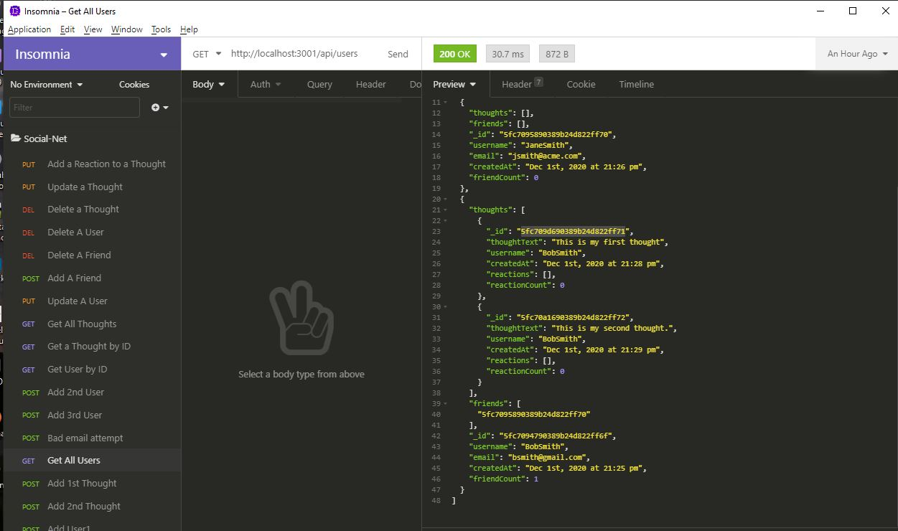

# Social-Net
A Social Networking Application
(Richard Ay, November 2020)

## Table of Contents
* [Project Objective](#project-objective)
* [Acceptance Criteria](#acceptance-criteria)
* [Technologies Used](#technologies-used)
* [Social-Net Logic](#social-net-logic)
* [Application Screen Shot and Videos](#application-screen-shot)

## Project Objective
As a social media startup, I want an API for my social network that uses a NoSQL database
so that my website can handle large amounts of unstructured data.

## Acceptance Criteria
Given a social network API:

1) When I enter the command to invoke the application, then my server is started and the Mongoose models are synced to the MongoDB database.

2) When I open API GET routes in Insomnia Core for users and thoughts, then the data for each of these routes is displayed in a formatted JSON.

3) When I test API POST, PUT, and DELETE routes in Insomnia Core, then I am able to successfully create, update, and delete users and thoughts in my database.

4) When I test API POST and DELETE routes in Insomnia Core, then I am able to successfully create and delete reactions to thoughts and add and remove friends to a user’s friend list.

## Technologies Used
* The NPM package express
* The NoSQL MongoDB database 
* The Mongoose ODM
* The MVC (Model - View - Controller) architecture

## Social-Net Logic
This application follows the MVC (model-view-controller) architecture.  

The (data) models and associated schema are defined in the \models directory.  The models are packaged together in the 'index.js' file found in the \models directory.

The API routes to the server are defined in the \routes\api directory.  The routes are packaged together in the 'index.js' file in the \routes\api directory.  In the \routes directory, the 'index.js' file prepends the routes with '\api' to simplify later access and coding.

The files in the \controllers directory tie the models and routes together.  The functions here are the call-backs for the routes, this is where the actual database access happens.

The primary (parent) data is the 'users' document.  'Thoughts' and 'Friends' are sub-documents to 'users', and 'reactions' are sub-documents to 'thoughts'.

## Application Screen Shot
The following screen shot shows the (test) operation of the API routes in 'Insomnia'.  The referenced videos can be found in the \videos subdirectory of the repository.

